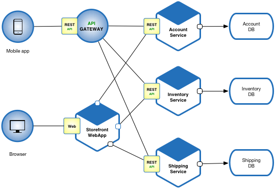
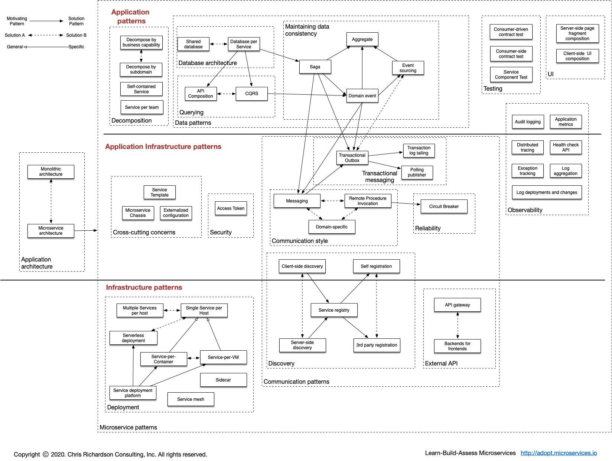
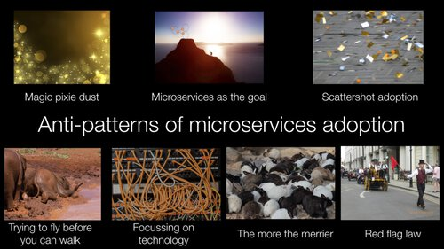

# [microservices.io](https://microservices.io/)

Personal project for study purposes about translate to Vietnamese from [microservices.io](https://microservices.io/).

## What are microservices?

Microservices - also known as the microservice architecture - is an architectural style that structures an application as a collection of services that are

- Highly maintainable and testable
- Loosely coupled
- Independently deployable
- Organized around business capabilities
- Owned by a small team

The microservice architecture enables the rapid, frequent and reliable delivery of large, complex applications. It also enables an organization to evolve its technology stack.

## The pattern language is your guide

The microservice architecture is not a silver bullet. It has several drawbacks. Moreover, when using this architecture there are numerous issues that you must address.

The microservice architecture pattern language is a collection of patterns for applying the microservice architecture. It has two goals:

The pattern language enables you to decide whether microservices are a good fit for your application.
The pattern language enables you to use the microservice architecture successfully.
A good starting point is the Monolithic Architecture pattern, which is the traditional architectural style that is still a good choice for many applications. It does, however, have numerous limitations and issues and so a better choice for large/complex applications is the Microservice architecture pattern.

## Avoid the potholes

Thinking of migrating to the microservice architecture? If so, you should look at this presentation about the potholes in the road from monolithic hell and read this series of blog posts about anti-patterns and how to avoid them.

  

## Assess your architecture

If you have built an application with the microservice architecture then take a look at the Microservices Assessment Platform. The platform assesses what you have built and identifies what needs to be improved. It reduce architectural and organizational risk and maximizes the benefits of the microservice architecture.
